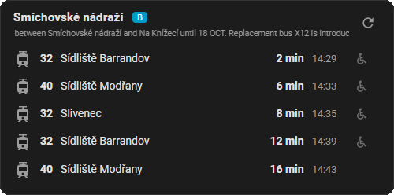
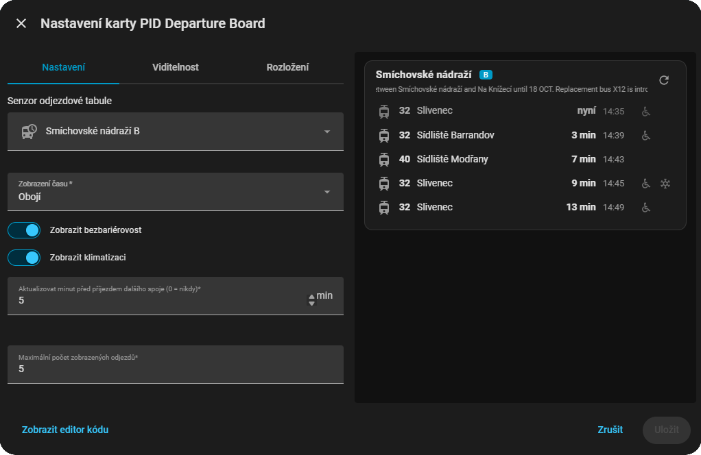

# PID Departure Boards – karty pro Home Assistant <!-- omit from toc -->

[](https://github.com/hondzik/pid-departure-boards-ui/releases)
[](LICENSE)
[](https://github.com/hondzik)

[](https://github.com/hondzik/pid-departure-boards-ui/commits/main)

[English](README.md)

## Obsah <!-- omit from toc -->

- [Popis](#popis)
- [Co balíček obsahuje](#co-balíček-obsahuje)
- [Požadavky](#požadavky)
- [Instalace](#instalace)
- [Karta: Odjezdová tabule](#karta-odjezdová-tabule)
  - [Jak funguje](#jak-funguje)
  - [Možnosti konfigurace](#možnosti-konfigurace)
  - [Použití vizuálního editoru](#použití-vizuálního-editoru)
- [Řešení problémů](#řešení-problémů)
- [Překlady](#překlady)
- [Přispěvatelé](#přispěvatelé)

## Popis

Vlastní Lovelace **karta** pro Home Assistant, která zobrazuje odjezdovou tabuli zastávky Pražské integrované dopravy (PID) — linku, cíl, čas do odjezdu, zpoždění a informace o bezbariérovosti. Data čte z integrace [`pid_departure_boards`](https://github.com/hondzik/pid-departure-boards) a sama nikdy nevolá API Golemio.



## Co balíček obsahuje

| Karta | Co zobrazuje |
| ----- | ------------ |
| `pid-departure-boards-ui-departures-card` | Nejbližší odjezdy z jednoho nástupiště, tlačítko aktualizace a volitelně oznámení (výluky). |

## Požadavky

- Nastavená integrace [`pid_departure_boards`](https://github.com/hondzik/pid-departure-boards) alespoň s jedním nástupištěm (jeden senzor na nástupiště).

## Instalace

Nainstalujte přes [HACS](https://hacs.xyz/) pomocí tlačítka níže, nebo přidejte tento repozitář ručně jako vlastní repozitář v HACS (kategorie: plugin), pokud ještě není ve výchozím obchodě.

[](https://my.home-assistant.io/redirect/hacs_repository/?repository=pid-departure-boards-ui&owner=hondzik&category=Plugin)

## Karta: Odjezdová tabule


`type: custom:pid-departure-boards-ui-departures-card`

### Jak funguje

V záhlaví karty je název zastávky a nástupiště, pod ním jeden řádek na každý nejbližší odjezd.

- Řádek obsahuje ikonu vozidla, číslo linky, cíl, čas do odjezdu a/nebo čas odjezdu, zpoždění (`+5`, jen když má vůz zpoždění) a ikony bezbariérovosti a klimatizace.
- Zobrazený čas je vždy podle jízdního řádu a zpoždění je uvedeno vedle něj; odpočet, řazení a obnova používají reálný očekávaný čas včetně zpoždění. Odjezdy, které už odjely, samy zmizí.
- Zrušené spoje jsou přeškrtnuté; řádek bliká, dokud vůz stojí v zastávce (po najetí myší se zobrazí „na zastávce"; při zapnutém omezení animací se řádek místo toho zvýrazní).
- Oznámení (např. výluky) z integrace jsou zobrazena pod názvem zastávky v jednom řádku, který se nepřetržitě posouvá (více oznámení se spojí mezerou).
- Kliknutím na název zastávky se v okně zobrazí mapa zastávky.
- Výška karty sleduje mřížku dashboardu: při změně velikosti v editoru zobrazí tolik odjezdů, kolik se vejde (2 řádky = 1 odjezd, 3 řádky = 3, 4 řádky = 5, ...).
- Stav senzoru se mění jen při aktualizaci integrace, takže odpočet „za X min" počítá karta sama.
- **Aktualizace:** tlačítko vpravo nahoře obnoví senzor okamžitě. Navíc karta obnovuje senzor každou minutu od chvíle, kdy je nejbližší odjezd blíž než nastavený počet minut. Pro všechny karty na stránce běží jeden sdílený časovač, senzory splatné ve stejnou chvíli se obnoví jedním voláním a více karet se stejným senzorem ho obnoví jen jednou — víc karet tak nevyčerpá limit požadavků API Golemio.

### Možnosti konfigurace

| Volba | Typ | Výchozí | Popis |
| ----- | --- | ------- | ----- |
| `entity` | `string` | – (povinné) | Senzor integrace `pid_departure_boards`. |
| `title` | `string` | název zastávky | Vlastní nadpis karty. |
| `time_display` | `time` / `countdown` / `both` | `both` | Zobrazit čas odjezdu, čas do odjezdu, nebo obojí. |
| `show_wheelchair` | `boolean` | `true` | Zobrazit ikonu bezbariérového spoje. |
| `show_air_conditioned` | `boolean` | `true` | Zobrazit ikonu klimatizace. |
| `refresh_lead_min` | `number` | `5` | Aktualizovat senzor tolik minut před nejbližším odjezdem, pak každou minutu. `0` automatickou aktualizaci vypne. |
| `max_departures` | `number` | všechny ze senzoru | Maximální počet zobrazených odjezdů. |

```yaml
type: custom:pid-departure-boards-ui-departures-card
entity: sensor.smichovske_nadrazi_b
time_display: both
show_wheelchair: true
show_air_conditioned: false
refresh_lead_min: 5
max_departures: 5
```

### Použití vizuálního editoru

Kartu přidejte z nabídky karet (nabízí se pro senzory integrace `pid_departure_boards`) nebo upravte existující. V editoru jsou dostupné všechny výše uvedené volby:



## Řešení problémů

- **Karta se u mého senzoru nenabízí** — po výběru entity se karta nabízí jen u senzorů integrace `pid_departure_boards`; jinak ji vyberte ručně ze „Všech karet" („Custom: PID Departure Board"). Po aktualizaci karty obnovte cache prohlížeče.
- **Tabule zobrazuje „Odjezdy nejsou dostupné"** — integrace se nepodařilo aktualizovat z API; zkontrolujte logy integrace.
- **Čas se mezi aktualizacemi neodpočítává** — ověřte, že karta v prohlížeči není uspaná; odpočet se počítá v prohlížeči každých pár sekund.
- **Nezobrazuje se zpoždění** — zobrazí se jen tehdy, když ho vůz hlásí (`+m` při kladném zpoždění).

## Překlady

Karta a její editor jsou přeložené do jazyků: čeština, němčina, angličtina, španělština, francouzština, hebrejština, maďarština, italština, japonština, nizozemština, norština, polština, portugalština, slovenština, švédština, ukrajinština a čínština (pro ostatní jazyky se použije angličtina). Čeština a angličtina jsou udržované autorem; **všechny ostatní překlady jsou strojové** a mohou obsahovat chyby. Našli jste chybu nebo chcete další jazyk? Založte issue nebo PR — opravy jsou vítané.

## Přispěvatelé

[](https://github.com/hondzik/pid-departure-boards-ui/graphs/contributors)
