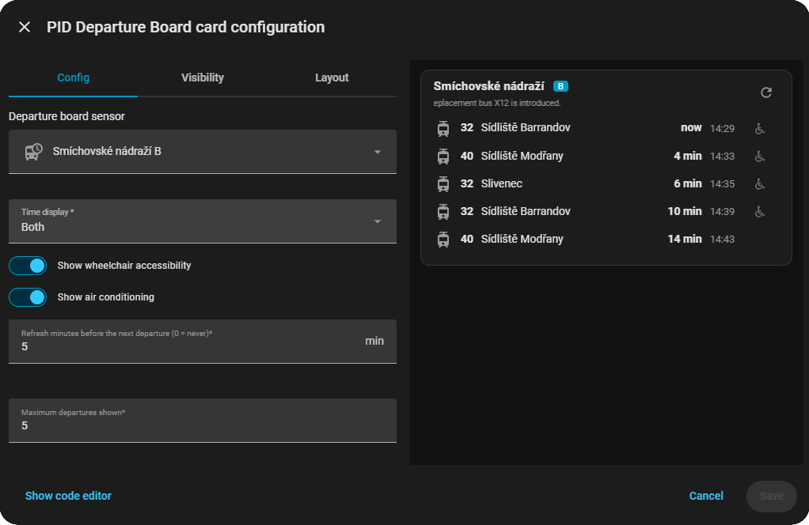

# PID Departure Boards – cards for Home Assistant <!-- omit from toc -->

[](https://github.com/hondzik/pid-departure-boards-ui/releases)
[](LICENSE)
[](https://github.com/hondzik)

[](https://github.com/hondzik/pid-departure-boards-ui/commits/main)

[Čeština](README.cs.md)

## Table of contents <!-- omit from toc -->

- [Description](#description)
- [What's in this bundle](#whats-in-this-bundle)
- [Requirements](#requirements)
- [Installation](#installation)
- [Card: Departure board](#card-departure-board)
  - [How it works](#how-it-works)
  - [Configuration options](#configuration-options)
  - [Using the visual editor](#using-the-visual-editor)
- [Troubleshooting](#troubleshooting)
- [Translations](#translations)
- [Contributors](#contributors)

## Description

This is a custom Home Assistant Lovelace **card** that shows a departure board for a stop of the Prague Integrated Transport (PID) — line, destination, time until departure, delay and accessibility info. It reads the data from the [`pid_departure_boards`](https://github.com/hondzik/pid-departure-boards) integration and never talks to the Golemio API itself.


## What's in this bundle

| Card | What it shows |
| ---- | ------------- |
| `pid-departure-boards-ui-departures-card` | Upcoming departures from one stop platform, with a refresh button and optional notices (closures). |

## Requirements

- The [`pid_departure_boards`](https://github.com/hondzik/pid-departure-boards) integration set up with at least one stop platform (one sensor per platform).

## Installation

Install through [HACS](https://hacs.xyz/) using the badge below, or add this repository manually as a custom HACS repository (category: plugin) if it isn't listed in the default store yet.

[](https://my.home-assistant.io/redirect/hacs_repository/?repository=pid-departure-boards-ui&owner=hondzik&category=Plugin)

## Card: Departure board


`type: custom:pid-departure-boards-ui-departures-card`

### How it works

The card shows the stop name and platform in the header and one row per upcoming departure.

- Each row has a vehicle icon, the line number, the destination, the time until departure and/or the departure clock time, the delay (`+5` only when the vehicle is late) and the wheelchair / air-conditioning icons.
- The clock time is always the timetable (scheduled) time and the delay is shown next to it; the countdown, ordering and refresh use the real expected time including the delay. Departures that are already gone disappear on their own.
- Canceled departures are struck through; a row blinks while the vehicle is standing at the stop (hover shows "at the stop"; with reduced motion enabled the row is highlighted instead).
- Notices (e.g. closures) from the integration are shown under the stop name as a single line of text that scrolls endlessly (several notices are joined with a space).
- Click the stop name to open a map of the stop in a popup.
- The card's height follows the dashboard grid: resize it in the dashboard editor and it shows as many departures as fit (2 rows = 1 departure, 3 rows = 3, 4 rows = 5, ...).
- The sensor itself only changes when the integration updates, so the "in X min" countdown is computed by the card.
- **Refresh:** the button in the top right corner refreshes the sensor immediately. In addition, once the next departure is closer than the configured number of minutes the card refreshes the sensor every minute. One shared timer serves all cards on the page, sensors due at the same time are refreshed in a single call and several cards showing the same sensor refresh it only once — so many cards don't exhaust the Golemio API rate limit.

### Configuration options

| Option | Type | Default | Description |
| ------ | ---- | ------- | ----------- |
| `entity` | `string` | – (required) | A sensor of the `pid_departure_boards` integration. |
| `title` | `string` | stop name | Custom card title. |
| `time_display` | `time` / `countdown` / `both` | `both` | Show the departure clock time, the time until departure, or both. |
| `show_wheelchair` | `boolean` | `true` | Show the wheelchair-accessible icon. |
| `show_air_conditioned` | `boolean` | `true` | Show the air-conditioning icon. |
| `refresh_lead_min` | `number` | `5` | Refresh the sensor this many minutes before the next departure, then every minute. `0` turns the automatic refresh off. |
| `max_departures` | `number` | all from the sensor | Maximum number of departures shown. |

```yaml
type: custom:pid-departure-boards-ui-departures-card
entity: sensor.litochlebske_namesti_opatov
time_display: both
show_wheelchair: true
show_air_conditioned: false
refresh_lead_min: 5
max_departures: 5
```

### Using the visual editor

Add the card from the card picker (it is offered for sensors of the `pid_departure_boards` integration) or edit an existing card. Every option above is available in the editor:



## Troubleshooting

- **The card isn't offered for my sensor** — only sensors created by the `pid_departure_boards` integration get the card suggested after selecting an entity; otherwise pick it manually from "All cards" ("Custom: PID Departure Board"). Reload the browser cache after updating the card.
- **The board shows "Departures are unavailable"** — the integration failed to update from the API; check the integration's logs.
- **The times don't count down between updates** — make sure the browser tab isn't suspended; the countdown is computed in the browser every few seconds.
- **No delay shown** — the delay is shown only when the vehicle reports one (`+m` for a positive delay).

## Translations

The card and its editor are localized into: Czech, German, English, Spanish, French, Hebrew, Hungarian, Italian, Japanese, Dutch, Norwegian, Polish, Portuguese, Slovak, Swedish, Ukrainian and Chinese (falls back to English for any other language). Czech and English are maintained by the author; **all other translations are machine-translated** and may contain mistakes. Spot something wrong or want another language? Feel free to open an issue or PR — corrections are always welcome.

## Contributors

[](https://github.com/hondzik/pid-departure-boards-ui/graphs/contributors)
